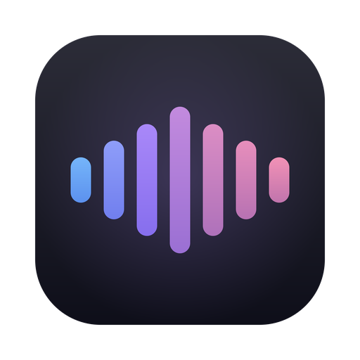

<p align="center">
  
</p>

<h1 align="center">Private Whisper</h1>

<p align="center"><em>Push-to-talk dictation with AI cleanup — 100% local, on macOS and Windows.</em></p>

> Monorepo: `macos/` (shipping app) · `windows/` (in development) · `shared/` (canonical prompts + model manifest) · `evals/` (the quality gate every platform must pass) · `docs/`

Push-to-talk dictation for macOS, 100% local: hold **Right Option**, speak (English, German, Swiss German, French), release — polished text appears at the cursor of whatever app has focus.

Pipeline: `AVAudioEngine` mic capture → **whisper.cpp** (Metal, embedded) → cleanup pass via **LM Studio** (local, OpenAI-compatible) → paste injection with pasteboard restore. No network egress; all endpoints are `localhost`.

## Requirements

- Apple Silicon Mac, macOS 15+
- Whisper models in `~/Library/Application Support/PrivateWhisper/models/` (`ggml-large-v3-turbo.bin` and/or `ggml-large-v3.bin`, from [ggerganov/whisper.cpp on Hugging Face](https://huggingface.co/ggerganov/whisper.cpp)) — already downloaded on this machine
- LM Studio running with the local server enabled on `http://localhost:1234/v1` (for the cleanup pass; without it the raw transcript is injected)

## Build & run

```bash
cd macos && ./scripts/build_app.sh   # swift build + assemble + codesign
open macos/build/PrivateWhisper.app
```

On first launch, grant:

1. **Microphone** — prompted automatically.
2. **Accessibility** — needed for the global hotkey and for the Cmd+V injection. System Settings → Privacy & Security → Accessibility → enable Private Whisper. Relaunch the app after granting.

## Usage

- Hold **Right Option**, dictate, release. The menu-bar icon shows state: mic (idle) → red mic (recording) → hourglass (processing) → green check (inserted).
- Yellow warning icon = cleanup fell back to the raw transcript (LM Studio down/slow) — your dictation is never lost.
- No text field focused / password field → a HUD shows the text with a Copy button instead.
- Menu bar → **Open Private Whisper…** for the app window: usage statistics (dictations, words, latency, per-language and per-day breakdown — counters only, no transcript content) and Settings (hotkey, microphone, whisper model, LM Studio URL/model with connection test, cleanup toggle/timeout, notch indicator, history logging, launch at login).
- A Siri-style floating capsule below the notch shows live state: waveform while recording, shimmer while transcribing, checkmark when inserted.
- **Personal dictionary** (app window → Dictionary): names/jargon are biased into whisper's recognition and enforced by the cleanup model.
- **Backtracking & lists**: "am Dienstag — nein, ich meine Mittwoch" keeps only Mittwoch; "erstens… zweitens…" becomes a formatted list.
- **Per-app tone**: the cleanup register adapts to the frontmost app (formal in Mail, casual in Slack, verbatim-technical in VS Code) — editable in Settings.
- **Command mode**: select text anywhere, hold **Right Command**, speak an instruction ("make this more concise", "übersetze auf Englisch") — the selection is replaced by the edited version.
- **Correction learning (experimental)**: after injecting, the app re-reads the target field 10–25 s later; words you manually re-spelled ("Kohler"→"Koller") appear as one-click dictionary suggestions. Suggestion-only, never automatic; works in AX-friendly apps (Mail, TextEdit, native fields), silently inactive elsewhere. Toggle in Settings.

### Remote cleanup (Mac Mini)

The cleanup LLM doesn't have to run on this machine: in LM Studio on the Mac Mini enable the server with "Serve on Local Network", then set the Server URL in Settings to e.g. `http://mac-mini.local:1234/v1` and pick a model (Test Connection lists what's available). Note this sends transcripts over your LAN to your own machine — still no cloud involved.

Config lives at `~/Library/Application Support/PrivateWhisper/config.json`.

## Sharing / installing on another Mac

```bash
cd macos && ./scripts/package.sh     # → macos/build/PrivateWhisper-<version>.dmg (+ SHA-256)
```

The DMG is small — models are NOT bundled. On first launch the app shows a setup banner with one-click downloads and progress bars: the Whisper model (required, 1.5 GB) and the embedded cleanup model (optional, 2.7 GB — Qwen 3.5 4B GGUF served by a bundled `llama-server` sidecar, started on demand, stopped after 10 min idle). **LM Studio is no longer required**: the backend resolves automatically — LM Studio (local or remote Mac Mini) if reachable, else the embedded sidecar, else raw transcripts.

Signing: the app is signed with a development certificate, so recipients must right-click → **Open** on first launch (or System Settings → Privacy & Security → **Open Anyway**). Gatekeeper-clean distribution requires a paid Apple Developer ID + notarization — hook it into scripts/package.sh when available.

## Uninstall

Settings → **Remove Downloaded Models…** (deletes `~/Library/Application Support/PrivateWhisper`, ~4 GB), then quit and trash the app. Dragging the app to the Trash alone leaves the models folder behind.

## Headless test mode

```bash
./macos/build/PrivateWhisper.app/Contents/MacOS/PrivateWhisper --test-file audio.wav [--no-cleanup]
```

Prints JSON with raw transcript, detected language, cleaned text, and timings. Used by the automated pipeline tests (`say`-synthesized EN/DE/FR audio).

## Cleanup-model eval

`evals/run_eval.py` scores candidate LM Studio models on multilingual dictation cleanup (language preservation incl. Helvetisms, filler removal, meaning/numbers preservation, latency), judged by a large local model. See `evals/` and DECISIONS.md for results.

## Performance (M4 Max, measured)

- Whisper large-v3-turbo, 10 s utterance: ~0.5 s transcription
- Cleanup (qwen3-8b, warm): ~0.7 s
- End-to-end after key release: **~1.5 s** (target was ≤ 3 s)
